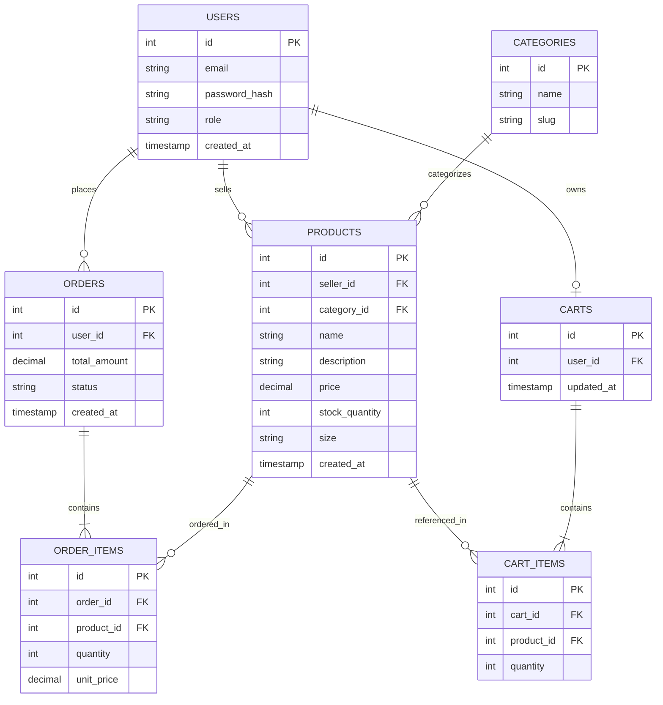

# Sprint 1: System Architecture & Scope Definition

**Course:** E-Commerce
**Project:** RackHouse — Apparel & Accessories Marketplace for Independent Sellers

---

## 1. Target Audience & Market Focus

**Primary Persona:**
Independent and small-business apparel sellers (solo designers, boutique owners, small clothing brands with fewer than 10 SKUs-per-month turnover) who currently sell through informal channels (social media DMs, marketplaces with high fee structures, or in-person only) and need a dedicated, low-overhead storefront. The secondary persona is the retail consumer browsing and purchasing from these sellers.

**Core Pain Point:**
Small apparel sellers lack an affordable, easy-to-operate platform that combines catalog management, persistent cart behavior, and reliable checkout without the fee structures or feature bloat of large general-purpose marketplaces. Consumers, in turn, lack a consolidated place to discover and purchase from multiple small apparel sellers with a consistent, trustworthy checkout experience.

**Domain Scope:**
Apparel & Accessories (clothing, footwear, bags, jewelry). The MVP scope is deliberately narrowed to a single vertical to keep taxonomy, sizing/variant logic, and catalog design tractable within a one-semester academic timeline.

---

## 2. MVP Feature Scope Matrix

| Category | Feature Name | Description | Priority |
|---|---|---|---|
| Authentication | User Registration & Authentication | Password hashing (bcrypt, cost factor 12) and JWT-based session/authentication mechanism, with role distinction between `customer` and `seller/admin`. | High (MVP) |
| Catalog | Product List & Search | Product browsing interface with taxonomy-based filtering (category, size, price range) and keyword search. | High (MVP) |
| Cart | Cart Management | State-persistent cart management (item addition, quantity modification, deletion), persisted server-side per authenticated user. | High (MVP) |
| Checkout | Order Processing | Mock or Stripe payment gateway integration and order object instantiation, including order status transitions. | High (MVP) |
| Admin | Inventory Control | Administrative CRUD operations for product inventory (create/edit/delist products, adjust stock quantity). | Medium |
| Catalog | Category Management | Admin-defined category taxonomy used to organize products and drive catalog filtering. | Medium |

This scope covers the full purchase funnel (browse → cart → checkout) plus the minimum seller-side tooling needed to keep the catalog populated, which is the smallest feasible slice that demonstrates the end-to-end system within the semester.

**Non-functional notes:** Authentication endpoints (`/register`, `/login`) should be rate-limited to mitigate brute-force attempts, and all write operations on `PRODUCTS`/`ORDERS` should validate that the requesting user's `role` and ownership (`seller_id` / `user_id`) match the resource being modified.

---

## 3. Tech Stack Selection & Justification

- **Frontend Framework:** Next.js (React)
  *Justification:* Next.js provides file-based routing, built-in API route handling for lightweight backend calls, and server-side rendering for product pages, which benefits SEO and initial load performance for a catalog-driven storefront — advantages a plain client-rendered React SPA would not offer out of the box.

- **Backend Infrastructure:** Node.js / Express
  *Justification:* Express offers a minimal, well-documented framework for building the REST API surface (auth, catalog, cart, orders) with a shared JavaScript/TypeScript language across the stack, reducing context-switching for a small student team compared to introducing a second language (e.g., Python/Django) purely for the backend.

- **Database Management System:** PostgreSQL
  *Justification:* The domain is inherently relational — users, products, categories, orders, and order line items all have well-defined foreign-key relationships and require transactional integrity (e.g., atomic order/stock updates). PostgreSQL's strong constraint enforcement, native `ENUM` types, and ACID guarantees are better suited here than a schema-less NoSQL store like MongoDB, which would require re-implementing referential integrity and domain validation in application code.

- **Caching & Asynchronous Processing (Optional):** Redis
  *Justification:* Redis can back session/cart caching to reduce database round-trips on repeated cart reads, and can queue background tasks such as order-confirmation emails, decoupling non-critical work from the checkout request path.

- **Deployment & Environment:** Frontend deployed on Vercel (native Next.js support, zero-config SSR); backend API and PostgreSQL hosted on a managed platform such as Render or Railway, with environment-based config separating development and production credentials.
  *Justification:* Keeping the frontend and backend on separate, purpose-built platforms avoids managing a custom server for SSR while still giving the API/database a persistent, always-on environment that serverless functions alone would complicate for stateful DB connections.

---

## 4. Entity-Relationship Diagram (ERD)

### Cardinality & Relationship Summary

| Relationship | Type | Notes |
|---|---|---|
| USERS → ORDERS | 1:N | One user places zero or more orders. |
| USERS → PRODUCTS | 1:N | One user (with `role = seller`) lists zero or more products. |
| USERS → CARTS | 1:0..1 | Each user has at most one active cart; a new user has none until an item is added. |
| CARTS → CART_ITEMS | 1:N | One cart contains zero or more cart line items. |
| PRODUCTS → CART_ITEMS | 1:N | One product may appear in many carts' line items. |
| CATEGORIES → PRODUCTS | 1:N | One category classifies zero or more products. |
| ORDERS → ORDER_ITEMS | 1:N | One order contains one or more order line items (an order requires at least one item). |
| PRODUCTS → ORDER_ITEMS | 1:N | One product may appear in many order line items across different orders. |

`ORDER_ITEMS` and `CART_ITEMS` are both associative (junction) entities: `ORDER_ITEMS` resolves the N:M relationship between `ORDERS` and `PRODUCTS`, and `CART_ITEMS` resolves the N:M relationship between `CARTS` and `PRODUCTS`.

### Attribute Data Types & Constraints

| Entity | Attribute | Type | Key / Constraint |
|---|---|---|---|
| USERS | id | INTEGER | PK |
| USERS | email | VARCHAR(255) | UNIQUE, NOT NULL |
| USERS | password_hash | VARCHAR(255) | NOT NULL |
| USERS | role | ENUM('customer','seller','admin') | NOT NULL, DEFAULT 'customer' |
| USERS | created_at | TIMESTAMP | NOT NULL, DEFAULT now() |
| CATEGORIES | id | INTEGER | PK |
| CATEGORIES | name | VARCHAR(100) | NOT NULL |
| CATEGORIES | slug | VARCHAR(100) | UNIQUE, NOT NULL |
| PRODUCTS | id | INTEGER | PK |
| PRODUCTS | seller_id | INTEGER | FK → USERS.id |
| PRODUCTS | category_id | INTEGER | FK → CATEGORIES.id |
| PRODUCTS | name | VARCHAR(150) | NOT NULL |
| PRODUCTS | description | TEXT | — |
| PRODUCTS | price | DECIMAL(10,2) | NOT NULL, CHECK (price >= 0) |
| PRODUCTS | stock_quantity | INTEGER | NOT NULL, DEFAULT 0 |
| PRODUCTS | size | VARCHAR(20) | — |
| PRODUCTS | created_at | TIMESTAMP | NOT NULL, DEFAULT now() |
| CARTS | id | INTEGER | PK |
| CARTS | user_id | INTEGER | FK → USERS.id, UNIQUE |
| CARTS | updated_at | TIMESTAMP | NOT NULL, DEFAULT now() |
| CART_ITEMS | id | INTEGER | PK |
| CART_ITEMS | cart_id | INTEGER | FK → CARTS.id |
| CART_ITEMS | product_id | INTEGER | FK → PRODUCTS.id |
| CART_ITEMS | quantity | INTEGER | NOT NULL, CHECK (quantity > 0) |
| ORDERS | id | INTEGER | PK |
| ORDERS | user_id | INTEGER | FK → USERS.id |
| ORDERS | total_amount | DECIMAL(10,2) | NOT NULL |
| ORDERS | status | ENUM('pending','paid','shipped','delivered','cancelled') | NOT NULL, DEFAULT 'pending' |
| ORDERS | created_at | TIMESTAMP | NOT NULL, DEFAULT now() |
| ORDER_ITEMS | id | INTEGER | PK |
| ORDER_ITEMS | order_id | INTEGER | FK → ORDERS.id |
| ORDER_ITEMS | product_id | INTEGER | FK → PRODUCTS.id |
| ORDER_ITEMS | quantity | INTEGER | NOT NULL, CHECK (quantity > 0) |
| ORDER_ITEMS | unit_price | DECIMAL(10,2) | NOT NULL |

`unit_price` is stored on `ORDER_ITEMS` (rather than joined live from `PRODUCTS`) to preserve the historical price at time of purchase, since `PRODUCTS.price` can change after an order is placed. `CARTS.user_id` is marked `UNIQUE` to enforce the 1:0..1 relationship at the database level, not just in application logic.
