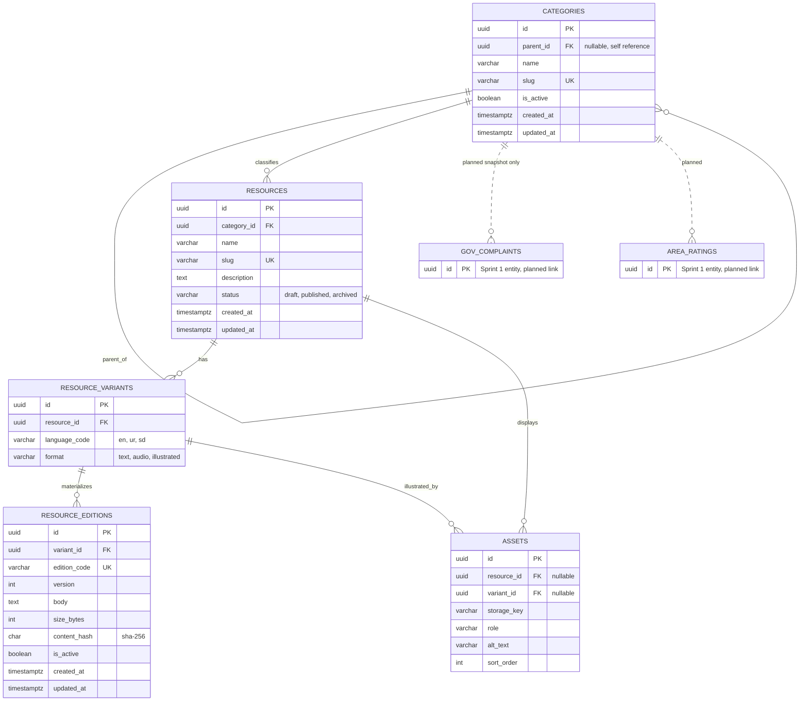

# Sprint 2 — Content Catalog Data Foundation (Flutter)

**Project:** FYP-77 — Dual-Path Personal Safety & Anti-Harassment Reporting App for Sindh
**Course sprint:** Sprint 2, Catalog Data Foundation (University of Sindh, Jamshoro)
**Sprint length:** 15 days · **Checkpoints:** Day 5, Day 10, Day 15
**Scope of this document:** the Flutter side (admin UI, models, local storage, API client, tests), plus the backend contract Flutter consumes.

> Anything marked `TODO` is evidence to paste in once you have run it. Nothing below claims a result that has not been produced yet.

---

## 0. How the e-commerce sprint maps onto this app

The Sprint 2 manual is written for a shop (products, SKUs, price, stock, carts, orders). This app has no shop, so the same *data-foundation ideas* are applied to the content the app must manage and ship offline: legal-rights guides, helpline directories, and "what to do right now" guides in Urdu, Sindhi, and English (proposal §4.1).

| Manual concept | In this app | Why it fits |
|---|---|---|
| Category tree | **Case category tree** (e.g. Workplace → Verbal) | Reused by the complaint form and the rule-guided assistant (§4.2) |
| Product | **Resource** (rights guide, helpline directory, what-to-do guide) | Admin-managed content with draft / published status |
| Variant | **Variant** = language × format (`en/ur/sd` × `text/audio/illustrated`) | Real option combinations, some of which do not exist |
| SKU | **Edition** = the versioned, downloadable content for one variant | Has a unique code, a version, and an active flag |
| Price | *Not applicable* — replaced by `version` (int ≥ 1) | No money in this app |
| Stock ≥ 0 | `size_bytes` ≥ 0 and *at most one active edition per variant* | Same integrity idea: DB-enforced numeric and availability rules |
| Cart / Order | **Gov-path complaints** (planned, snapshot only — see §3.3) | The catalog must never be linked to user identity |
| Admin | **Content administrator** (Ombudsman-office or project staff) | Only role allowed to write catalog data |

**Privacy boundary (important):** the catalog is public, non-personal content. It lives in its own schema (`content`) and has **no foreign key to either identity system** (Governmental account or Non-Governmental anonymous ID). This keeps the "two paths must never be linked" rule from proposal §3 intact.

---

## 1. Sprint goal and scope boundary

**Goal:** Given a content administrator, the system persists categories, resources, variants, and editions without losing identity, relationship, version, or availability meaning — and the Flutter admin UI can create, read, and update them through an authenticated API.

**In scope**
- Category tree management (stable IDs, unique slugs, no cycles, deactivate).
- Resource create/edit with status (`draft`, `published`, `archived`).
- Variants and editions with unique codes, versions, and active flags.
- Authenticated admin screens in Flutter for all of the above.
- Constraints, migrations, seed data, focused tests.

**Out of scope (Sprint 3+)** — may be stubbed, must not be claimed as done:
dynamic specifications, asset upload, public catalog reads, offline bundling into the user-facing app, search, publication workflow, and the Gov-path complaint flow itself.

### Flutter work plan

| Days | Focus | Checkpoint |
|---|---|---|
| 1–3 | Project structure, API client, Drift schema, auth/login screen | App runs; admin can log in against a stub/real API |
| 4–6 | Category tree screen + form | Create / edit / deactivate a category; nested list renders |
| 7–9 | Resource list + form; variant & edition editor | Valid combinations only; unavailable ones shown as disabled |
| 10–12 | Error handling, 401/403 flow, seed-driven demo | Protected screens; demo works from clean seed |
| 13–14 | Widget + unit tests, docs, evidence | `flutter test` green; this file complete |
| 15 | Sprint review | Demo, peer review, Sprint 3 hand-off |

---

## 2. Sprint 1 decisions reused or changed

| Sprint 1 decision | Status in Sprint 2 |
|---|---|
| Flutter mobile client | **Reused** — admin module added inside the same app shell |
| Spring Boot REST API | **Reused** — `/api/v1/admin/...` namespace |
| PostgreSQL | **Reused** — new `content` schema, separate from the two identity schemas |
| SQLite / Drift local storage | **Reused** — tables created now, populated in Sprint 3 |
| Two separate identity systems | **Reused, reinforced** — catalog has no FK to either |
| Initial ERD | **Extended** — see §3; original entities are shown connected, not replaced |
| E-commerce "Carts/Orders" | **Changed** — replaced by Gov-path complaints (§3.3) |

`TODO:` link the actual Sprint 1 document/commit here.

---

## 3. Updated ERD and data dictionary

### 3.1 ERD



**Cardinalities**
- Category → Category: one parent, zero or more children (`0..1` parent).
- Category → Resource: one category, zero or more resources. A resource has **exactly one** canonical category.
- Resource → Variant: one resource, zero or more variants.
- Variant → Edition: one variant, zero or more editions (versions); **at most one active**.
- Resource/Variant → Asset: stubbed table only; upload is Sprint 3.

### 3.2 Data dictionary and constraints

| Table | Column | Type | Rule |
|---|---|---|---|
| categories | id | uuid | PK |
| | parent_id | uuid null | FK → categories.id; `CHECK (parent_id <> id)`; cycle trigger |
| | name | varchar(120) | NOT NULL |
| | slug | varchar(120) | NOT NULL, UNIQUE, matches `^[a-z0-9]+(-[a-z0-9]+)*$` |
| | is_active | boolean | NOT NULL, default true |
| resources | category_id | uuid | NOT NULL, FK → categories.id |
| | slug | varchar(120) | NOT NULL, UNIQUE |
| | status | varchar(16) | `CHECK IN ('draft','published','archived')`, default `draft` |
| resource_variants | resource_id | uuid | NOT NULL, FK → resources.id |
| | language_code | varchar(2) | `CHECK IN ('en','ur','sd')` |
| | format | varchar(16) | `CHECK IN ('text','audio','illustrated')` |
| | — | — | `UNIQUE (resource_id, language_code, format)` |
| resource_editions | variant_id | uuid | NOT NULL, FK → resource_variants.id |
| | edition_code | varchar(64) | NOT NULL, UNIQUE |
| | version | int | `CHECK (version >= 1)` |
| | size_bytes | int | `CHECK (size_bytes >= 0)` |
| | content_hash | char(64) | SHA-256 of body (same idea as the evidence-vault hash in proposal §4.2) |
| | is_active | boolean | partial unique index: one active edition per variant |

**Foreign-key delete / update policy**

| FK | ON DELETE | ON UPDATE | Reason |
|---|---|---|---|
| categories.parent_id → categories | RESTRICT | CASCADE | Deactivate instead of delete |
| resources.category_id → categories | RESTRICT | CASCADE | Never orphan a resource |
| resource_variants.resource_id → resources | RESTRICT | CASCADE | Archive instead of delete |
| resource_editions.variant_id → resource_variants | RESTRICT | CASCADE | Editions are history |
| assets.resource_id / variant_id | CASCADE | CASCADE | Assets are disposable files |

**Key DDL (Flyway migration, backend owner)**

```sql
CREATE SCHEMA IF NOT EXISTS content;

CREATE TABLE content.categories (
  id         uuid PRIMARY KEY DEFAULT gen_random_uuid(),
  parent_id  uuid REFERENCES content.categories(id) ON DELETE RESTRICT ON UPDATE CASCADE,
  name       varchar(120) NOT NULL,
  slug       varchar(120) NOT NULL UNIQUE
             CHECK (slug ~ '^[a-z0-9]+(-[a-z0-9]+)*$'),
  is_active  boolean NOT NULL DEFAULT true,
  created_at timestamptz NOT NULL DEFAULT now(),
  updated_at timestamptz NOT NULL DEFAULT now(),
  CHECK (parent_id IS NULL OR parent_id <> id)
);

CREATE TABLE content.resource_editions (
  id           uuid PRIMARY KEY DEFAULT gen_random_uuid(),
  variant_id   uuid NOT NULL REFERENCES content.resource_variants(id)
               ON DELETE RESTRICT ON UPDATE CASCADE,
  edition_code varchar(64) NOT NULL UNIQUE,
  version      int NOT NULL CHECK (version >= 1),
  body         text NOT NULL,
  size_bytes   int NOT NULL CHECK (size_bytes >= 0),
  content_hash char(64) NOT NULL,
  is_active    boolean NOT NULL DEFAULT false,
  created_at   timestamptz NOT NULL DEFAULT now(),
  updated_at   timestamptz NOT NULL DEFAULT now()
);

-- at most one active edition per variant
CREATE UNIQUE INDEX one_active_edition_per_variant
  ON content.resource_editions (variant_id) WHERE is_active;

-- category cycle prevention (DB-level, not only API validation)
CREATE FUNCTION content.prevent_category_cycle() RETURNS trigger AS $$
BEGIN
  IF NEW.parent_id IS NOT NULL AND EXISTS (
    WITH RECURSIVE up AS (
      SELECT id, parent_id FROM content.categories WHERE id = NEW.parent_id
      UNION ALL
      SELECT c.id, c.parent_id FROM content.categories c JOIN up ON c.id = up.parent_id
    )
    SELECT 1 FROM up WHERE id = NEW.id
  ) THEN
    RAISE EXCEPTION 'category cycle' USING ERRCODE = '23514';
  END IF;
  RETURN NEW;
END $$ LANGUAGE plpgsql;

CREATE TRIGGER trg_category_cycle
  BEFORE INSERT OR UPDATE OF parent_id ON content.categories
  FOR EACH ROW EXECUTE FUNCTION content.prevent_category_cycle();
```

### 3.3 Planned connection to Sprint 1 entities

- **Gov complaints** do **not** hold a foreign key to `categories`. The selected category is copied as a *code snapshot* (`category_slug`) **inside the encrypted payload**. Reasons: (1) a plaintext FK would leak what kind of complaint exists; (2) deactivating a category can never break a stored complaint.
- **Area ratings** (community layer) may reference `categories` for incident type in Sprint 3, using the pseudonymous community ID only.
- **Emergency contacts, SOS sessions, check-ins** (Non-Gov path) have **no** connection to the catalog.

### 3.4 Flutter-side local model (Drift)

Mirror tables are created now so Sprint 3 can bundle content offline. They hold only catalog data.

```dart
class Categories extends Table {
  TextColumn get id => text()();
  TextColumn get parentId => text().nullable().references(Categories, #id)();
  TextColumn get name => text()();
  TextColumn get slug => text().unique()();
  BoolColumn get isActive => boolean().withDefault(const Constant(true))();
  @override Set<Column> get primaryKey => {id};
}

class ResourceEditions extends Table {
  TextColumn get id => text()();
  TextColumn get variantId => text()();
  TextColumn get editionCode => text().unique()();
  IntColumn get version => integer().check(version.isBiggerOrEqualValue(1))();
  IntColumn get sizeBytes => integer().check(sizeBytes.isBiggerOrEqualValue(0))();
  BoolColumn get isActive => boolean().withDefault(const Constant(false))();
  @override Set<Column> get primaryKey => {id};
}
```

---

## 4. Administration routes and Flutter screens

Base URL comes from `--dart-define=API_BASE_URL=...`. All routes require `Authorization: Bearer <admin token>`.

| Method | Route | Purpose | Flutter screen |
|---|---|---|---|
| POST | `/api/v1/admin/categories` | Create category | `CategoryFormSheet` |
| GET | `/api/v1/admin/categories` | Category tree | `CategoryTreeScreen` |
| PATCH | `/api/v1/admin/categories/{id}` | Update / deactivate | `CategoryFormSheet` |
| POST | `/api/v1/admin/resources` | Create draft resource | `ResourceFormScreen` |
| GET | `/api/v1/admin/resources` | List resources | `ResourceListScreen` |
| PATCH | `/api/v1/admin/resources/{id}` | Update content or status | `ResourceFormScreen` |
| POST | `/api/v1/admin/resources/{id}/variants` | Add variant (language × format) | `VariantEditorScreen` |
| POST | `/api/v1/admin/variants/{id}/editions` | Add edition | `EditionFormSheet` |
| PATCH | `/api/v1/admin/editions/{id}` | Update body, version, active flag | `EditionFormSheet` |

**Status codes:** `200` ok · `201` created · `400` malformed/validation · `401` no/invalid token · `403` not an admin · `404` not found · `409` duplicate slug/code · `422` business-rule violation (cycle, publish without active edition).

**Consistent error shape** (Flutter parses this into `ApiError`):

```json
{
  "error": {
    "code": "DUPLICATE_SLUG",
    "message": "A category with this slug already exists.",
    "fields": { "slug": "already in use" }
  }
}
```

### Example — create category

```http
POST /api/v1/admin/categories
Authorization: Bearer <redacted>
Content-Type: application/json

{ "name": "Verbal Harassment", "slug": "verbal-harassment", "parentId": "c1a0…workplace" }
```

```json
201 Created
{
  "id": "7f3b…",
  "parentId": "c1a0…workplace",
  "name": "Verbal Harassment",
  "slug": "verbal-harassment",
  "isActive": true
}
```

### Example — add edition

```http
POST /api/v1/admin/variants/{variantId}/editions
{ "editionCode": "RIGHTS-UR-TXT-V1", "version": 1, "body": "…", "isActive": true }
```

```json
201 Created
{ "id": "a91c…", "editionCode": "RIGHTS-UR-TXT-V1", "version": 1,
  "sizeBytes": 2048, "contentHash": "e3b0c4…", "isActive": true }
```

### Example — rejection paths

| Request | Response |
|---|---|
| Duplicate slug | `409` `DUPLICATE_SLUG`, `fields.slug` set |
| Duplicate edition code | `409` `DUPLICATE_EDITION_CODE` |
| Category parent = own descendant | `422` `CATEGORY_CYCLE` |
| Publish resource with no active edition | `422` `NO_ACTIVE_EDITION` |
| No token / non-admin token | `401` / `403` |

`TODO:` paste real request/response captures from your run (redact tokens and private URLs).

### Flutter structure

```
lib/
  core/
    api/            api_client.dart (dio + auth interceptor), api_error.dart
    storage/        token_store.dart (flutter_secure_storage), app_database.dart (drift)
  features/admin_content/
    data/           category_repository.dart, resource_repository.dart, dto/
    domain/         category.dart, resource.dart, variant.dart, edition.dart, validators.dart
    presentation/   login_screen.dart, category_tree_screen.dart,
                    resource_list_screen.dart, resource_form_screen.dart,
                    variant_editor_screen.dart, widgets/
```

**UI rules**
- Client validators mirror server rules (slug regex, required fields, `version ≥ 1`) for fast feedback; **the server stays the authority**.
- A `409` or `422` maps to inline field errors, never a raw stack trace or generic "something went wrong".
- A `401` clears the stored token and routes to login; a `403` shows a "not authorized" screen.
- The variant editor shows the full language × format grid. Combinations that do not exist render as a **disabled chip** ("Not available"), not as an empty edition.
- Large touch targets, plain labels, Urdu/Sindhi-ready layout (RTL-safe widgets) so the admin UI shares the app's low-literacy-friendly conventions.

```dart
class ApiError implements Exception {
  ApiError(this.code, this.message, {this.fields = const {}, this.status});
  final String code;
  final String message;
  final Map<String, String> fields;
  final int? status;

  factory ApiError.fromDio(DioException e) {
    final err = (e.response?.data is Map) ? e.response!.data['error'] : null;
    return ApiError(
      err?['code'] ?? 'NETWORK_ERROR',
      err?['message'] ?? 'Could not reach the server.',
      fields: Map<String, String>.from(err?['fields'] ?? {}),
      status: e.response?.statusCode,
    );
  }
}
```

---

## 5. Data integrity and authorization decisions

**Integrity is enforced in PostgreSQL, not only in the API** (CAT05): `UNIQUE` on slugs and edition codes, `CHECK` on version and size, FKs with explicit policies, a partial unique index for the single active edition, and a trigger for category cycles.

**Authorization:** JWT bearer token, role `ADMIN` required on every write (and on admin reads). The Governmental-path user account and the anonymous Non-Governmental ID have **no** admin role. Hiding the admin entry in Flutter is only a convenience; the server rejects the request regardless.

**Business-rule answers (from the manual)**

1. **Can a draft resource have no edition? Can a published one have none?** A draft may have none. Publishing requires at least one active edition (`422 NO_ACTIVE_EDITION`). *Example:* seed resource "What To Do Right Now" stays draft until its first edition is active.
2. **One category or many?** One canonical category (single FK). It keeps the tree and the complaint-form picker simple; tags/many-to-many are a Sprint 3 option.
3. **Parent category deactivated?** All descendants are deactivated in one transaction. Resources are kept (never deleted) and hidden from public reads; the admin list shows an "inactive category" badge.
4. **How is an unavailable edition shown publicly?** The variant is listed with `available: false` rather than hidden or faked. In the app UI it appears as "Not yet available in Sindhi" with a fallback offer (e.g. Urdu).
5. **Price rules?** No price exists. The equivalent: two variants may share a version number, but within one variant only one edition is active, and a new active edition replaces the old one.
6. **What prevents invalid numbers and duplicate codes?** `CHECK (size_bytes >= 0)`, `CHECK (version >= 1)`, `UNIQUE (edition_code)`; the API turns violations into `409`/`400`, not a traceback.
7. **What happens to something referenced later after deactivation?** Complaints never reference the catalog by FK (see §3.3). They store a snapshot inside the encrypted payload, so deactivating or archiving cannot break an existing case.

---

## 6. Seed data and demonstration

**Command (backend):** `TODO: e.g. ./mvnw spring-boot:run -Dspring.profiles.active=seed`
**Reset:** `TODO: drop schema content and re-run migrations + seed`

**Categories (two levels)**

| Root | Child |
|---|---|
| Workplace Harassment | Verbal Harassment · Cyber Harassment |
| Public Space Safety | Stalking and Following |

**Resources, variants, editions (≥ 3 resources, ≥ 4 editions)**

| Resource | Status | Variant (lang / format) | Edition code | Notes |
|---|---|---|---|---|
| Your Rights Under the 2010 Act | published | en / text | `RIGHTS-EN-TXT-V1` | |
| | | ur / text | `RIGHTS-UR-TXT-V1` | |
| | | sd / text | `RIGHTS-SD-TXT-V1` | |
| | | ur / audio | `RIGHTS-UR-AUD-V1` | |
| | | **sd / audio** | — | **Intentionally unavailable combination** |
| Emergency Helplines Directory | published | en / text | `HELPLINES-EN-TXT-V1` | Use real, verified numbers only |
| What To Do Right Now | draft | en / text | `NOWGUIDE-EN-TXT-V1` | Inactive edition; cannot be published yet |

**Demonstration script (record request/response for each step)**
1. Log in as admin (token redacted).
2. Create category → resource → variant → edition.
3. `GET /admin/categories` and `GET /admin/resources`; show the new records.
4. Try a duplicate slug and a cycle; show `409` and `422`.
5. In Flutter, repeat steps 2–4 through the screens; capture screenshots.

`TODO:` paste evidence into this section.

---

## 7. Test strategy, command, and result

| Area | Tests (Flutter) | Type |
|---|---|---|
| Models | JSON ↔ `Category`/`Resource`/`Edition` round-trip | unit |
| Validators | slug format, required fields, `version ≥ 1` | unit |
| Repository | maps `409`/`422` to `ApiError` with `fields` | unit (mock dio) |
| Auth | `401` clears token and routes to login; `403` shows not-authorized | unit + widget |
| Category tree | nested rendering, deactivate action | widget |
| Forms | duplicate slug shows inline error | widget |
| Variant grid | missing combination renders disabled, not as an edition | widget |
| Happy path | login → create category → create resource | integration |

Backend tests (owner: backend teammate) must cover duplicate slug/code, cycle prevention, version/size rules, and unauthenticated/unauthorized writes.

**Commands**

```bash
flutter pub get
dart run build_runner build --delete-conflicting-outputs
flutter test
flutter test integration_test      # needs a running API
```

**Result:** `TODO: paste the passing output and date`

---

## 8. Known limitations and Sprint 3 backlog

**Limitations**
- Catalog admin is online-only; offline bundling is not built yet.
- Assets and specifications exist as planned design, not features.
- One category per resource.
- The admin entry point shares the app shell; a separate admin app may be cleaner later.

**Sprint 3 backlog**
1. Public catalog reads and Drift sync (download active editions, verify `content_hash`).
2. Offline reader screens for rights guides and helplines (Urdu/Sindhi/English).
3. Asset upload (audio/illustrations) and the `ASSETS` table behaviour.
4. Specification validation rule (JSONB or EAV, decided and documented).
5. Publication workflow and review states.
6. Complaint form consuming the category tree, with the snapshot stored inside the encrypted payload.
7. Search over resources.

---

## Setup (README section)

```bash
git clone <repo-url> && cd <repo>
flutter pub get
dart run build_runner build --delete-conflicting-outputs
flutter run --dart-define=API_BASE_URL=http://10.0.2.2:8080   # Android emulator → host machine
```

| Variable | Purpose | Example |
|---|---|---|
| `API_BASE_URL` | Backend base URL (passed with `--dart-define`) | `http://10.0.2.2:8080` |

Do **not** commit tokens, keystores, or `.env` files with secrets. The admin token is kept only in `flutter_secure_storage` at runtime.
